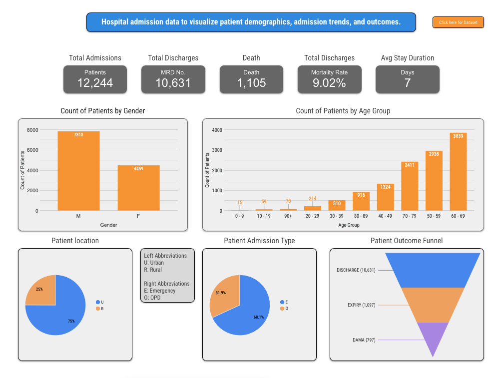
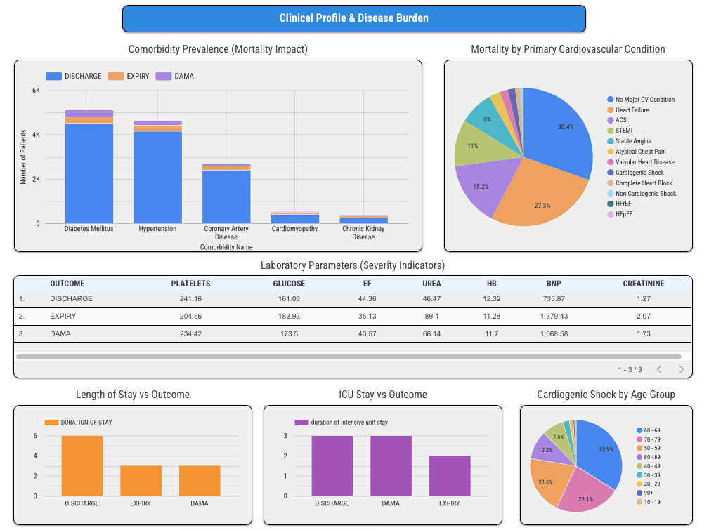
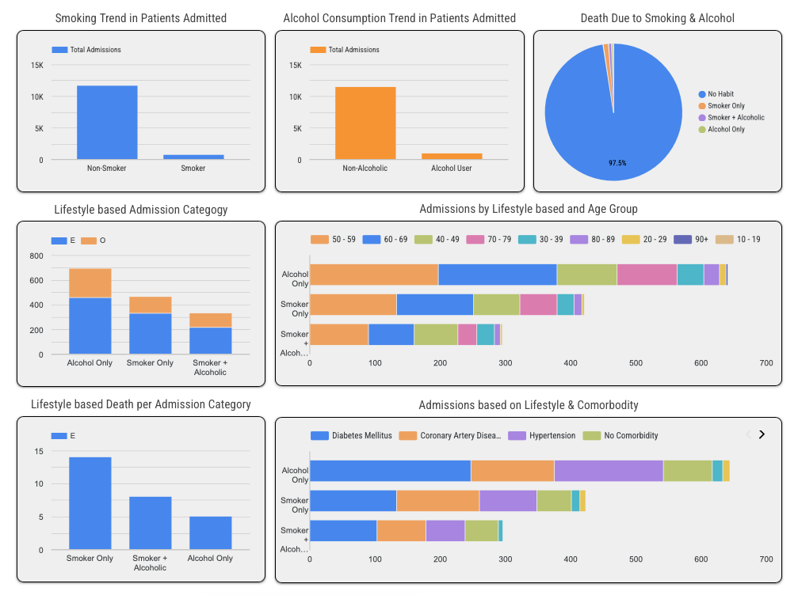

# 🏥 Hospital Admission Dashboard — Looker Studio Visualization

This project presents an **interactive Looker Studio dashboard** built to visualize hospital admission data.  
The dataset includes **patient demographics, comorbidities, outcomes, lifestyle habits, and clinical parameters**, enabling insights into hospital trends, mortality, and disease patterns.

---

## 📊 Overview

The dashboard is divided into **three key sections** to provide a comprehensive understanding of patient trends and hospital outcomes:

1. **Patient Demographics & Admissions**
2. **Clinical Profile & Disease Burden**
3. **Lifestyle & Risk Behavior Insights**

Each section explores different aspects of hospital data — from who the patients are, to what conditions they face, and how lifestyle choices influence outcomes.

---

## 🚀 Interactive Dashboard

You can explore the full **Hospital Admission Analytics Dashboard** here:  
👉 [**View Live Dashboard on Looker Studio**](https://lookerstudio.google.com/reporting/4c372c07-a921-44be-8d66-0464d21604ed)

---
## 🧩 Dataset Description

The dataset includes detailed information for each patient admission:

| Category | Fields |
|-----------|---------|
| **Identifiers** | SNO, MRD No. |
| **Dates** | Date of Admission (DOA), Date of Discharge (DOD) |
| **Demographics** | Age, Gender, Locality (Urban/Rural) |
| **Admission Details** | Type (Emergency/OPD), Duration of Stay, ICU Duration, Outcome |
| **Lifestyle Factors** | Smoking, Alcohol |
| **Comorbidities** | DM, HTN, CAD, CMP, CKD |
| **Lab Parameters** | HB, TLC, Platelets, Glucose, Urea, Creatinine, BNP, EF |
| **Clinical Conditions** | STEMI, ACS, Heart Failure, Cardiogenic Shock, Pulmonary Embolism, etc. |

---

## 📈 Dashboard Sections & Insights

### 🩺 1. Patient Demographics and Admissions Overview

**Goal:** Understand the hospital’s patient composition and admission trends.

**Key Charts:**
- Total Admissions, Discharges, Deaths, Mortality Rate, Avg. Stay Duration
- Count of Patients by Gender
- Count of Patients by Age Group
- Patient Location (Urban vs Rural)
- Admission Type (Emergency vs OPD)
- Outcome Funnel (Discharge → Expiry → DAMA)

**Insights:**
- Majority of admissions were **male patients aged 50–69 years**.
- **Urban patients** account for ~75% of total admissions.
- **68%** of admissions were **emergency cases**.
- Average hospital stay: **7 days**; Mortality rate: **~9%**.

---

### ⚕️ 2. Clinical Profile & Disease Burden

**Goal:** Assess disease distribution, comorbidity impact, and clinical severity.

**Key Charts:**
- Comorbidity Prevalence (Mortality Impact) — 100% stacked bar showing discharge vs expiry.
- Mortality by Primary Cardiovascular Condition — Pie chart (Heart Failure, ACS, STEMI, etc.).
- Laboratory Parameters by Outcome — Table comparing averages (HB, EF, BNP, etc.).
- Length of Stay vs Outcome — Expired patients had longer stay durations.
- ICU Stay vs Outcome — Higher ICU time correlates with higher mortality.
- Cardiogenic Shock by Age Group — Visualizes high-risk elderly patients.

**Insights:**
- **Diabetes Mellitus and Hypertension** were the most common comorbidities.
- **Heart Failure (27%)** and **ACS (15%)** were major contributors to mortality.
- Expired patients showed **higher BNP and Urea** and **lower EF**, indicating cardiac strain.
- **Older age groups (60–79)** exhibited higher mortality and ICU stay rates.

---

### 🚬 3. Lifestyle and Risk Behavior Analysis

**Goal:** Examine how smoking and alcohol consumption affect patient outcomes.

**Key Charts:**
- Smoking Trend in Patients Admitted
- Alcohol Consumption Trend in Patients Admitted
- Death Due to Smoking & Alcohol (Pie Chart)
- Lifestyle-based Admission Category (Emergency vs OPD)
- Admissions by Lifestyle & Age Group
- Lifestyle-based Death per Admission Category
- Admissions based on Lifestyle & Comorbidity

**Insights:**
- ~90% of patients had **no smoking or alcohol habits**, yet lifestyle-linked cases showed **higher mortality**.
- **Smokers + Alcoholics** had the **highest expiry proportion** despite lower total admissions.
- Lifestyle risks were more prevalent among **middle-aged males (40–69 years)**.
- **Hypertension and Diabetes** were most common in lifestyle-linked patients.

---

## 🧠 Key Takeaways

- **Age, comorbidities, and lifestyle** are key predictors of hospital outcomes.
- Patients with **multiple comorbidities** (DM + HTN + CAD) show **higher mortality** and ICU stay duration.
- **Elevated lab values** like BNP, Urea, and Creatinine are strong indicators of poor prognosis.
- Lifestyle factors, though less common, are **disproportionately fatal** among admitted cases.

---

## 🧰 Tools & Technologies

- **Google Looker Studio (Data Studio)** — Dashboard creation and visualization
- **Google Sheets / CSV Data Source** — Data storage
- **Custom Fields & Formulas:**
  - `Mortality Rate = (SUM(Death) / COUNT(MRD No.)) * 100`
  - `Death = CASE WHEN OUTCOME = "EXPIRY" THEN 1 ELSE 0 END`
  - `Age Group = CASE WHEN AGE BETWEEN 0 AND 9 THEN '0-9' ... END`
  - `Lifestyle Status = CASE WHEN SMOKING=1 AND ALCOHOL=1 THEN 'Smoker + Alcoholic' ... END`

---

## 📘 Future Enhancements

- Add **trend analysis over time** (month-wise mortality, admissions, lifestyle changes).
- Integrate **severity scoring** combining comorbidities and lab parameters.
- Include **geographical distribution** of admissions by locality.
- Enable **interactive filtering** by gender, admission type, or outcome.

---

## 🧾 Dashboard Preview

| Section | Screenshot |
|----------|-------------|
| **Patient Demographics** |  |
| **Clinical Profile & Disease Burden** |  |
| **Lifestyle Insights** |  |
